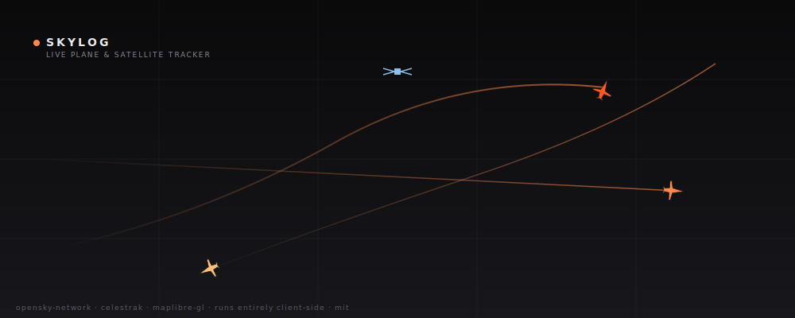

# Skylog

> Live plane and satellite tracker with an on-device loudness model. Runs entirely in your browser. No account, no server, no tracking.

**Live demo:** https://vnmoorthy.github.io/Skylog/



## What it does

Open it and you see a dark world map with every ADS-B-equipped aircraft currently in the map viewport, polled from the [OpenSky Network](https://opensky-network.org/) every 10 seconds. Each plane is a rotated glyph tinted by altitude, with a short fading trail showing its recent path. Pan or zoom anywhere — the next poll uses your new viewport, so Skylog behaves like a telescope you can sweep across the sky rather than a fixed dashboard.

Click any plane for a panel showing its callsign, airline, aircraft type and registration (resolved from a bundled OpenSky metadata snapshot), altitude, ground speed, vertical rate, and heading. Press `/` to search by callsign or ICAO24 hex code — pick one and the map flies to it.

Toggle the `satellites` layer to overlay the ISS and the other crewed/cargo stations. Positions are propagated client-side from Celestrak TLEs using the SGP4 algorithm (via `satellite.js`) — there is no server in the loop.

Optionally, set a **home location**. Skylog then enables a background pass-logger: every aircraft that transits your radius is written to IndexedDB, its closest-approach ground distance is computed with the Haversine formula, and its ground-level sound pressure level is estimated with an on-device acoustic model (inverse-square law + ISO 9613-2 atmospheric absorption). The last 24 hours of passes appears as a horizontal timeline.

## Why this exists

Map-first flight trackers bury the best thing about aviation — the physical experience of a plane flying overhead — behind ads, paywalled history, and UIs designed for spotters. When you hear a loud plane overhead you already lost the race to identify it in Flightradar24 before it's gone. Skylog inverts the question: "what just flew over me, and how loud was it?" is answerable after the fact, from your own browser, without handing your location to a third party.

## The loudness model

For each aircraft sample we receive, we estimate the A-weighted sound pressure level (SPL) at the observer using two physical effects in series: geometric spreading (inverse-square law) and atmospheric absorption.

### The inverse-square law

A point source radiating power **W** into a free field spreads that power over an expanding spherical wavefront of area **4πr²**. Intensity is power-per-area, so intensity falls as **1/r²**:

$$
I(r) = \frac{W}{4\pi r^{2}}
$$

Sound pressure level is defined logarithmically against a reference. Because intensity is proportional to the square of pressure, doubling distance halves pressure and SPL drops by exactly **20·log₁₀(2) ≈ 6.02 dB**:

$$
L(r) = L_{\mathrm{ref}} - 20\,\log_{10}\!\left(\frac{r}{r_{\mathrm{ref}}}\right)
$$

We take **r_ref = 1 m** and calibrate source levels **L_ref** per aircraft category against published certification and flyover data.

### Atmospheric absorption

Air is not a perfect propagation medium. Molecular relaxation of nitrogen and oxygen, viscosity, and thermal conduction remove acoustic energy from the wave as it travels. ISO 9613-2:1996 §7.2 defines a frequency-, temperature-, and humidity-dependent attenuation coefficient **α** in dB/m. For broadband aircraft noise centered around 500–1000 Hz, at 10 °C / 60 % RH / 101.325 kPa, the collapsed single-number representative is approximately **0.005 dB/m** (= 5 dB/km). We apply this as a linear term.

### Combined equation

$$
L_{\mathrm{observed}} \;=\; L_{\mathrm{source}} \;-\; 20\,\log_{10}\!\left(\frac{r_{\mathrm{slant}}}{1\,\mathrm{m}}\right) \;-\; \alpha\, r_{\mathrm{slant}}
$$

Where **r_slant = √(groundDistance² + altitude²)**. A pass's reported dB is the *minimum* r_slant over the pass — the point of closest approach.

### Constants

| Symbol | Meaning | Value | Units | Source |
| --- | --- | --- | --- | --- |
| L_src (HEAVY, e.g. 747) | Source level at 1 m | 140 | dB(A) | Calibrated against FAA AC 36-1H flyover data |
| L_src (LARGE, e.g. 737/A320) | Source level at 1 m | 135 | dB(A) | Calibrated against FAA AC 36-1H |
| L_src (SMALL, regional jets / turboprops) | Source level at 1 m | 125 | dB(A) | Calibrated against FAA AC 36-1H |
| L_src (LIGHT, Cessna-class) | Source level at 1 m | 105 | dB(A) | Calibrated against FAA AC 36-1H |
| L_src (ROTORCRAFT) | Source level at 1 m | 130 | dB(A) | Bell 212 flyover back-calculated |
| α | Atmospheric absorption | 0.005 | dB/m | ISO 9613-2:1996 §7.2, Table B.1 |
| r_ref | Reference distance | 1 | m | Convention |
| Earth radius (WGS-84 mean) | For Haversine | 6,371,008.7714 | m | IUGG 1980 |

Full constants table with inline citations: [`src/lib/acoustics.ts`](./src/lib/acoustics.ts).

### Worked example

Boeing 737 (`LARGE`, L_src = 135) at 3,000 ft directly overhead:

- altitude = 914 m → r_slant ≈ 914 m
- geometric loss: `20·log₁₀(914) ≈ 59.2 dB`
- atmospheric loss: `0.005 × 914 ≈ 4.6 dB`
- **L_observed ≈ 135 − 59.2 − 4.6 = 71.2 dB**

That matches a vacuum cleaner in the next room. A 747 (`HEAVY`, L_src = 140) at the same geometry lands at ~76 dB. A Cessna 172 (`LIGHT`, L_src = 105) at 1,500 ft lands at ~46 dB — barely audible over suburban ambient.

### What this model deliberately does not do

- No ground reflection (real aircraft noise can add ~3 dB from reflection at a standing listener).
- No directivity (modern turbofans radiate more forward than aft during climb; we treat every source as omnidirectional).
- No thrust modulation (a plane in climb is louder than the same plane in cruise; we use a single L_src per category).
- No per-frequency absorption (ISO 9613-2 varies α with frequency from 0.1 dB/km at 63 Hz to 80+ dB/km at 8 kHz).
- No weather integration (we assume still air at 10 °C / 60 % RH).

The goal is to distinguish a 747 from a Cessna at a glance, not to replace a certified noise measurement.

## Architecture

```
 ┌────────────────┐      10-s polling       ┌──────────────┐
 │  LiveMap.tsx   │ ──────────────────────▶ │   OpenSky    │
 │  + livePoller  │    bbox = viewport      │   REST API   │
 └────────────────┘                          └──────────────┘
        │    ▲
        │    │ StateVector[] each poll
        ▼    │
   ┌──────────────┐     optional, if home set     ┌──────────────┐
   │  MapLibre    │ ─────────────────────────────▶│ skyPoller    │
   │  GL markers  │   (radius-bbox polling,       │ worker       │
   │  + trails    │    acoustics, pass agg.)      └──────┬───────┘
   └──────────────┘                                       │ Dexie
                                                          ▼
                                                   ┌─────────────┐
                                                   │  IndexedDB  │
                                                   │  (72 h)     │
                                                   └─────────────┘

   ┌──────────────┐     1 Hz propagation          ┌──────────────┐
   │ SatelliteSG4 │ ──────────────────────────────│  Celestrak   │
   │  (on device) │    TLEs fetched once          │  TLE feed    │
   └──────────────┘                                └──────────────┘
```

The foreground poller and the satellite propagator are the only two modules that ever touch the network. The optional pass-logger runs in a web worker so acoustic calculations never block the map.

## Run locally

```bash
pnpm install
pnpm dev            # http://localhost:5173
```

Optional aircraft + airport metadata (adds type/operator/registration to clicked planes):

```bash
pnpm build:data     # fetches OpenSky aircraft CSV + OurAirports CSV,
                    # gzips compact JSON under public/data/
```

Build + preview:

```bash
pnpm build
pnpm preview        # serves the prod bundle
```

Tests:

```bash
pnpm test           # 75 unit tests — geo / acoustics / opensky / callsign / units
```

## Deploy

A GitHub Actions workflow in `.github/workflows/deploy.yml` auto-deploys every push to `main` to GitHub Pages. For a one-off manual deploy to any static host, drop the contents of `dist/` onto the host after `pnpm build`.

## Limitations

- **ADS-B coverage isn't perfect.** Most commercial traffic transmits, but some general-aviation aircraft and all military traffic don't. OpenSky has coverage gaps over ocean and remote areas.
- **OpenSky anonymous rate limits.** Anonymous callers get ~400 credits/day. Skylog uses one bounding-box query per 10 seconds. For a regional-sized bbox that's 1–2 credits/call — a few hours of continuous use before the daily cap. The UI surfaces the `rate_limited` state when you hit the ceiling. Signed-in OpenSky users can pass credentials; v0.1 doesn't expose that.
- **72-hour rolling buffer.** Older passes are dropped. The 50 MB IndexedDB ceiling triggers a 20 % prune when crossed.
- **Simplified loudness.** See "What this model deliberately does not do" above. Useful for relative comparisons, not certifiable measurements.

## License

MIT — see [`LICENSE`](./LICENSE).

## Acknowledgements

- [OpenSky Network](https://opensky-network.org/) — state vectors and aircraft metadata.
- [OurAirports](https://ourairports.com/) — airport metadata (public domain).
- [Celestrak](https://celestrak.org/) — satellite TLEs.
- [satellite.js](https://github.com/shashwatak/satellite-js) — SGP4 propagator port.
- [MapLibre GL](https://maplibre.org/) — open-source map renderer.
- [CARTO](https://carto.com/) — the free `dark_all` basemap tiles.
- [Dexie](https://dexie.org/) — a pleasant wrapper around IndexedDB.
