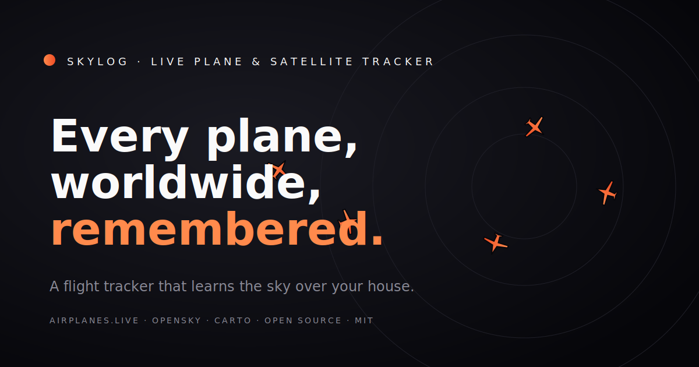

<div align="center">

# 🛩️ Skylog

### The flight tracker that **remembers every plane** it sees over your house.

**[🌍 Live Demo](https://vnmoorthy.github.io/Skylog/)** · **[📖 Docs](#how-it-works)** · **[💬 Discussions](https://github.com/vnmoorthy/Skylog/discussions)**

[](https://opensource.org/licenses/MIT)
[](https://www.typescriptlang.org/)
[](#)
[](#)
[](#)
[](https://github.com/vnmoorthy/Skylog/stargazers)



*Pan anywhere on the world, see live aircraft. Click a plane for everything we know about it. Set a home location, and Skylog will silently learn the regulars over your roof.*

</div>

---

## Why Skylog?

Every flight tracker on the internet is **amnesic**. Open Flightradar24, see a plane, click away — the app forgets it instantly. There's no concept of "your sky" because there's no concept of *you*.

Skylog inverts that:

- **It's yours.** No account, no tracker, no server. Your sky data lives only in your browser's IndexedDB.
- **It remembers.** Every aircraft Skylog renders gets saved with its callsigns, altitudes, and timestamps. After three days you'll discover that the 737 you keep hearing at 7 AM is the same airframe (UAL841) on the same daily route.
- **It tracks specific flights.** Paste a callsign, get a globally pinned flight + ETA to your home + a browser notification when it's 5 km out. The single-keystroke version of "is my partner's flight on time?".
- **It's worldwide.** Pan to Tokyo, Frankfurt, Dubai, Lagos — wherever the airplanes.live community has feeders, Skylog shows live traffic.

---

## ✨ Features

|   | Feature | Status |
| - | --- | :-: |
| 🌍 | Worldwide live aircraft map (every ADS-B-equipped plane in view) | ✅ |
| 🧠 | **Persistent memory** — every plane Skylog sees is saved to your device | ✅ |
| 🔁 | **Pattern detection** — finds your "regular visitors" by weekday + hour | ✅ |
| 🎯 | **Track a flight by callsign** — paste it, pin it, follow it globally | ✅ |
| 🔔 | Browser notification when a tracked flight is within 5 km of home | ✅ |
| 🛰️ | ISS + Celestrak satellite overlay with 90-min ground tracks | ✅ |
| 📊 | Daily digest: today vs yesterday, peak hour, top regulars | ✅ |
| 📞 | On-device acoustic model: estimate ground-level dB(A) of any pass | ✅ |
| 🗂️ | Searchable / sortable list of every aircraft in view | ✅ |
| 🌐 | Region presets: jump to Europe, Asia, Middle East, Oceania, etc. | ✅ |
| 📱 | Mobile responsive — works on phones | ✅ |
| ⌨️ | Keyboard-driven (`f` track flight, `m` memory, `s` satellites, `?` help) | ✅ |
| 🔒 | **Zero tracking. Zero cookies. Zero accounts. MIT licensed.** | ✅ |

---

## 🆚 vs Flightradar24, FlightAware, ADS-B Exchange

|   | Skylog | FR24 | FlightAware | ADS-B Exchange |
| --- | :-: | :-: | :-: | :-: |
| Free | ✅ | Limited | Limited | ✅ |
| Open source | ✅ | ❌ | Some | Some |
| Self-hostable | ✅ | ❌ | ❌ | Partial |
| No account required | ✅ | ❌ | ❌ | ✅ |
| No third-party tracker | ✅ | ❌ | ❌ | ❌ |
| **Per-aircraft persistent memory** | ✅ | ❌ | ❌ | ❌ |
| **Pattern detection ("regulars over your house")** | ✅ | ❌ | ❌ | ❌ |
| Track a flight by callsign | ✅ | ✅ | ✅ | ❌ |
| Browser-native push alerts | ✅ | App-only | App-only | ❌ |
| Satellite overlay | ✅ | ❌ | ❌ | ❌ |
| Ground-level loudness estimate | ✅ | ❌ | ❌ | ❌ |
| Worldwide coverage | Community feed | Comprehensive | Comprehensive | Comprehensive |

Skylog isn't trying to win on raw data quantity. It's trying to win on **knowing about *your* sky**.

---

## 🚀 Run it in 60 seconds

```bash
git clone https://github.com/vnmoorthy/Skylog.git
cd Skylog
pnpm install
pnpm dev
```

Open http://localhost:5173. That's it. No env vars. No accounts. No databases to provision.

Or skip the local install and **[try the live demo](https://vnmoorthy.github.io/Skylog/)**.

### Self-host on your own subdomain

The `main` branch auto-deploys to GitHub Pages on push (see [`.github/workflows/deploy.yml`](.github/workflows/deploy.yml)). Fork the repo, enable Pages with source "GitHub Actions", and your fork is live at `https://YOU.github.io/Skylog/` within minutes. No backend infra. No costs.

---

## How it works

```
 ┌─────────────────────────────────────────────────────────────┐
 │                         BROWSER                             │
 │                                                             │
 │  ┌─────────┐   bbox poll       ┌──────────────────────┐     │
 │  │ MapLibre│ ────────────────▶ │ airplanes.live API   │     │
 │  │ canvas  │ ◀──── states ──── │ (no auth, CORS-ok)   │     │
 │  └─────┬───┘                   └──────────────────────┘     │
 │        │ rAF dead-reckoning                                 │
 │        │ at 10 Hz between polls                             │
 │        ▼                                                    │
 │  ┌──────────────┐                                           │
 │  │  React UI    │   sightings   ┌───────────────────┐       │
 │  │  - FlightCard│ ────────────▶ │   IndexedDB       │       │
 │  │  - DigestCard│ ◀── memory ── │   (Dexie schema)  │       │
 │  │  - Memory    │               └───────────────────┘       │
 │  └──────────────┘                                           │
 │                                                             │
 │  ┌──────────────┐    ┌──────────────────┐                   │
 │  │ TLE worker   │ ── │ Celestrak (TLE)  │  satellite.js     │
 │  │ (sat orbits) │    └──────────────────┘  SGP4 client-side │
 │  └──────────────┘                                           │
 └─────────────────────────────────────────────────────────────┘
```

**Stack:** Vite · React 18 · TypeScript strict · Tailwind · Zustand · Dexie · MapLibre GL · D3 scales · satellite.js · Web Worker for the home-radius pass logger.

**Data sources:**
- [airplanes.live](https://airplanes.live/) — community ADS-B network, CORS-safe, no key needed
- [Celestrak](https://celestrak.org/) — TLEs for satellite propagation
- [CARTO](https://carto.com/) — dark basemap tiles
- [OpenSky aircraft DB](https://opensky-network.org/) — bundled aircraft type / operator metadata

---

## 🧠 The memory feature, explained

This is the differentiator. Every aircraft that enters your viewport is folded into IndexedDB:

```ts
interface AircraftSighting {
  icao24: string;
  lastCallsign: string | null;
  callsigns: readonly string[];     // every distinct callsign used
  registration: string | null;
  typecode: string | null;
  operator: string | null;
  firstSeenAt: number;              // unix-ms
  lastSeenAt: number;
  sightingCount: number;            // total polls including this aircraft
  dayCount: number;                 // distinct UTC days seen
  maxAltitudeM: number | null;
  minAltitudeM: number | null;
  recentDays: string;               // CSV of last 30 YYYY-MM-DD
  recentTimes: string;              // CSV of last 100 timestamps
}
```

The `recentTimes` slice powers `dominantPattern()`: bucket sightings by `(weekday, hour)` and surface any cluster of 3+ as a "regular visitor". After a week of leaving a tab open, the memory drawer reads:

> **Regular visitors over your sky:**
> CMP809 — Tuesdays around 07:00, ×7 sightings
> OCN642 — Tuesdays around 07:00, ×6 sightings
> BAW185 — Saturdays around 13:00, ×4 sightings

That's not data Flightradar24 will ever show you, because Flightradar24 doesn't know what *your* sky looks like.

---

## 🔬 The acoustic model (when home is set)

For each aircraft sample, Skylog estimates ground-level A-weighted SPL using:

1. **Inverse-square law** for geometric spreading: `L(r) = L_src - 20·log₁₀(r/1m)`
2. **ISO 9613-2:1996 §7.2** atmospheric absorption: `α ≈ 0.005 dB/m` at 10°C / 60% RH for broadband aircraft noise (~500–1000 Hz)

Combined: `L_observed = L_source - 20·log₁₀(r_slant) - α·r_slant`

Source levels are calibrated per ICAO aircraft category (HEAVY=140 dB, LARGE=135, SMALL=125, LIGHT=105, ROTORCRAFT=130) against published FAA flyover data. Constants and citations: [`src/lib/acoustics.ts`](./src/lib/acoustics.ts).

A 737 at 3,000 ft directly overhead → ~71 dB. Roughly the volume of a vacuum cleaner in the next room.

What the model deliberately doesn't do: ground reflection, directivity, thrust modulation, per-frequency absorption, weather. The goal is to distinguish a 747 from a Cessna at a glance, not to replace a certified noise meter.

---

## ⌨️ Keyboard shortcuts

| Key | Action |
| --- | --- |
| `f` | Track a specific flight by callsign |
| `m` | Open the aircraft memory drawer |
| `s` | Toggle satellite overlay |
| `l` | Toggle the in-view aircraft list |
| `h` | Open home setup |
| `t` | Open the pass timeline (requires home) |
| `?` | Show this help |
| `esc` | Close the active panel |

---

## 🛠️ Development

```bash
pnpm install
pnpm dev          # vite dev server on :5173
pnpm typecheck    # tsc -b --noEmit
pnpm test         # 101 unit tests
pnpm build        # production build
pnpm preview      # serve the production build
pnpm build:data   # optional: pre-fetch OpenSky aircraft DB for richer detail panel
```

Strict TypeScript throughout, no `any`. Coverage focuses on `src/lib/` (geo math, acoustics, callsign parsing, dead-reckoning, sightings).

---

## 🗺️ Roadmap

These are open issues — PRs welcome:

- [ ] Mobile installable PWA + offline support
- [ ] Time-machine: scrub backward through the last few minutes
- [ ] Webhook notifications (Discord, Slack) for tracked flights
- [ ] Public "share your sky" URL with stats
- [ ] Pluggable data sources (OpenSky direct via reverse proxy, ADS-B Exchange API)
- [ ] Plane fact cards (Wikipedia / aviation-trivia integration)
- [ ] Multi-home support
- [ ] Light theme

See [issues with the `good-first-issue` label](https://github.com/vnmoorthy/Skylog/issues?q=is%3Aissue+is%3Aopen+label%3A%22good+first+issue%22) for places to start contributing.

---

## 🤝 Contributing

PRs welcome. Read [CONTRIBUTING.md](./CONTRIBUTING.md) first. The codebase is small and well-tested — adding a feature or fixing a bug should be straightforward.

---

## 📜 License

[MIT](./LICENSE). Use it for whatever you want.

---

## 🙏 Acknowledgements

Skylog stands on the shoulders of:

- [airplanes.live](https://airplanes.live/) — the live ADS-B feed
- [OpenSky Network](https://opensky-network.org/) — aircraft metadata DB
- [Celestrak](https://celestrak.org/) — satellite TLE feed
- [CARTO](https://carto.com/) — dark basemap
- [MapLibre GL](https://maplibre.org/) — the open-source vector map renderer
- [satellite.js](https://github.com/shashwatak/satellite-js) — SGP4 orbital propagator
- [Dexie](https://dexie.org/) — wonderful IndexedDB wrapper

---

<div align="center">

**Built because I wanted to know which plane keeps waking me up at 3 AM.**

If Skylog is useful to you, **⭐ star this repo** so others find it.

</div>
